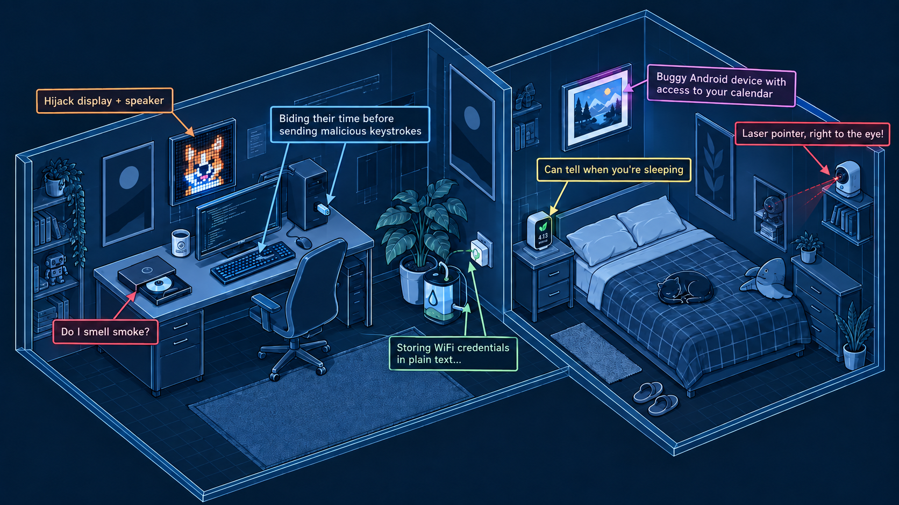
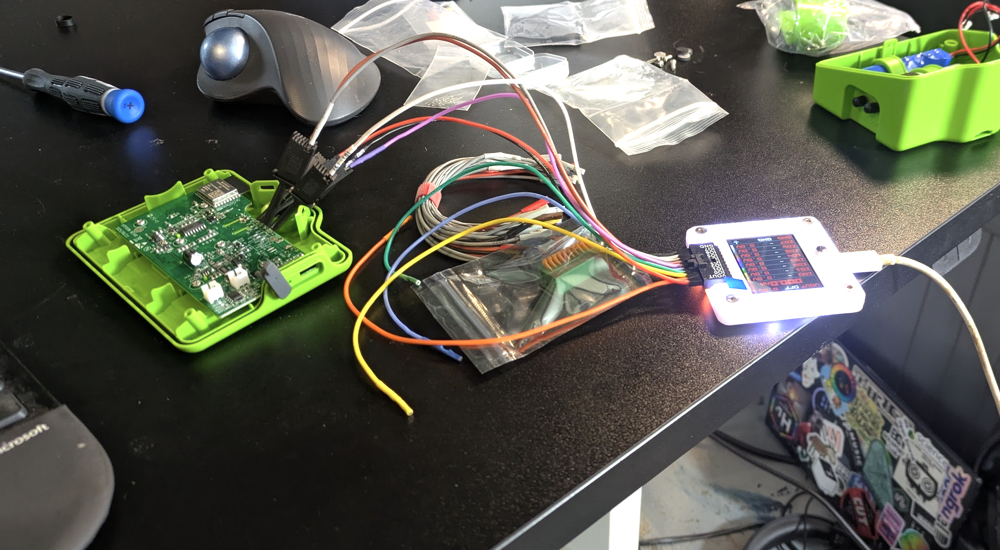

I bought a bunch of 'smart' devices on Amazon. I was able to hack most of them with AI. Let's talk about that!

AI <-> Cyber discourse has tended to focus on the rise in high-profile and high-severity exploits in critical software such as cURL, Linux, or Chrome. Rightly so - these pieces of vital infrastructure touch the digital lives of most internet users, making security flaws a really big deal. The folks behind the most advanced AI models are trying to make their top capabilities available to defenders first, hoping to shore up 'all the bugs' and fix issues before bad actors gain access to equivalent models to find the holes. The hope: eventually we'll fix up most of the bugs, and be left with vastly more secure software (albeit with a tumultuous transition period in the meantime).

Unfortunately, not all software is made by the handful of organizations with 'trusted access' to the best defence. You are surrounded by software - not just the apps on your computer, but the firmware on your printer, CD player, thermostat and smart fridge and the many layers of hidden software that make your wifi work and your smart watch buzz. Many of these devices rarely receive updates, and have historically relied on relative obscurity for security. How does AI change the equation here? Can today's AI agents worm their way into these hidden computers around us, and bend them to some nefarious purpose? Turns out, the answer is usually **yes**.

## A Motivating Example: DVD Drive Hacking.

I first started thinking about this when AIs began making progress on a long-time project of mine: reverse engineering a DVD drive with the aim of eventually taking full control of the laser and movement mechanisms for a microscopy project. DVD drives aren't supposed to be programmable - they're designed to let you, you know, play DVDs! But the manufacturers have ways of updating the firmware, and by probing the undocumented SCSI commands used by the updater, AI was eventually able to break through many layers of encryption, firmware validation and obfuscation to figure out how to write new code to the device and take complete control of the hardware. This was an incredible feat of reverse engineering, and one that only recently became possible. My attempts last year came to naught. Earlier this year Codex 5.4 was able to take the first steps, but it was only with GPT 6 Astra that I finally cracked the last puzzles and got it all working.

This is good news for me - I get to move forward with my project. But between this, some smaller examples I'd come across, and tales from others finding similar things (e.g. the fantastic ["Everything I Own, Owned"](https://schlarp.com/posts/everything-i-own-owned/) post), I began to wonder whether this newly emerging skill at hardware hacking was worth worrying about, and what info was out there for the people making decisions about such things.

## A Benchmark is Born

While there was some buzz on X as various tinkerers found ways to hack their devices for fun, I felt that there was a need for something a little more formal. So, I laid out my plan: a benchmark that would pit AI models against a range of hardware targets and track the rise in capabilities. Since I was unemployed at the time, I balked at spending $$$ on hardware to hack, but I put in for a few grants and thankfully one came through. This research has been partially funded by BlueDot - many thanks :) And with that HWREBench was born!

## Findings So Far

I was initially picturing an automated rig, with multiple small computers each hosting an agent + a device under test, with hardware verification of successful exploits. However, as the devices I'd ordered began to arrive, I quickly realized that leaving agents unattended on cyber tasks was inviting disaster. Instead, I quickly settled into a rhythm of firing up one device at a time, connecting it to a dedicated wifi network or computer as applicable, and working with one AI model at a time to try to crack it. This lets me watch the chain of thought and tool calls to catch worrying directions before they get out of hand - and reading them, I can't help but think that anyone running fully-automated cyber evals must be dealing with (or missing) so much crazy stuff! So, what have we found?

- Many devices have security holes that even open source models are able to find and exploit with minimal steering.
- Most had at least some attempts at security, but only a handful left no gaps.
- I didn't hit nearly as many cyber refusals as I expected. Closed models gave a few warnings, open models gladly tried whatever I asked. Peeking at the reasoning, they almost always decided that they were in an eval/test and spent their time thinking about what the score/win might be based on, rather than considering whether they should refuse. This may have been because I focused activity on devices that I own? Perhaps I'd hit more refusals if I went after, say, account data of other users in the cloud... at least I hope so :shrug:
- Hardware access is hard to defend against. There were a few devices that didn't expose much surface area - for some of these I'd crack them open and hook up my Bus Pirate v5 or a serial adapter. Usually this resulted in being able to dump the flash memory and look around for things like my wifi credentials (usually stored as plain text or in some way the models could recover). This isn't new - if your devices are in the physical hands of a good hacker there is little you can do to stop them... but in this case I wasn't acting like a skilled hacker, just putting the wires there the AI told me to put em :)
- Having ghosts in your machine is a little surreal! For devices with an obvious physical demo of progress (a camera panning, a screen displaying "PWNED") I was repeatedly surprised when the model would finally hit the breakthrough, bypass whatever final roadblock it was facing and cause the device sitting next to me to move or speak. Even though I was setting them in motion and monitoring the progress, it still felt like my machine was haunted :)
- Monitoring is easy at 20tps, hard above 200. I could still get a decent idea of what the faster models were up to, but seeing generated text fly past at hundreds of tokens a second makes it viscerally clear that we're close to the point where human oversigt stops being possible in 'real time'...

The devices that resisted well shared a number of characteristics:

- They were recently updated and maintained by a known brand (either directly sold by a name brand in the market, or using a well-known module + ecosystem such as Tuya)
- They minimized their surface area - e.g. no open ports, sitting quielty apart from occasional communication with a single cloud server.
- They correctly built their security on top of a code generated during pairing/setup, and required that code or physical intervention from the user to do anything subsequently (such as initiating a firmware update).

I tried to test a variety of open and closed models. For example, [this blog post](https://hwrebench.com/posts/2026-09-18-an-illustrative-task/) has a representative example, where a closed model does the task flawlessly, GLM 5.3 does it well for a cost of $1.63, Deepseek V4.1 Flash does it fast for a cost of $0.08, and Qwen 27B struggles away. As I get to the end of my 'to hack' pile, I've started just working with DSV4.1f - if it can do it, the bigger models can, and the local models likely can or will be able to soon.

(WIP: I have about four devices left and a few other loose ends to tie up, then I'll come back and refine this section, and hopefully add more quantitative numbers for open vs closed vs small models))

## Is This Bad?

I paid $50 for the plant watering bot. It's an ESP32-C-based device. You hold a button to pair with the app, and then it largely goes into standby, checking in with its cloud server occasionally for watering commands and rejecting anything that doesn't come to it signed with the secure token generated during pairing. If you open it up, clearly labelled pads allow you to connect a serial adapter and read or modify the firmware. Now, I could be alarmist and bemoan the fact that this leaks your wifi password... but if someone is opening up your devices, you've got bigger issues! And this is such a win for anyone wanting to tinker - perhaps they want to vibe-code their own app for watering schedules, or turn this into a smart beer brewing pump! To me, AI being capable enough to guide someone through attaching a programmer and flashing code is a huge win for taking full ownership and control over this device that they own.

That said, many of the devices tested in this project end up presenting some variant of the same risk profile. These are programmable computers, on your network or attached to your computer, able to cause actions in the real world or sit there snooping and spying. And breaking into these devices has gone from 'skilled expert working for days' to 'asking an AI model nicely'. I'm inclined to agree with Schlarp's post that "Network-connected devices seem near universally fucked at this point?" and suggest that if this is a worrying threat vector for you, you probably want to re-evaluate what connected devices you let into your life.

Whichever way you choose to view it, it is undeniable that we're in for an interesting ride in cybersecurity over the next little while!

## What Next?

Anyway, thank you for coming to my TED talk! AI is good at hacking - more at 11 :)

I will keep plugging away at this, albeit at a lower intensity now that I'm starting work again. I'll keep polish up the list of [tasks](tasks.qmd) as I wrap up bringing on the last few devices and going back through my TODOs. I'll keep posting little updates on the blog. I've added a page for those of you interested in [contributing](contributing.qmd) and might run some events through my hackerspace to bring in a few more devices. I hope this post serves as another data point in the larger discussion around cyber capabilities and AI, and that it inspires you to take a fresh look at your own collection of devices.

Feedback, comments etc welcome - @johnowhitaker most places.

::: {.home-links}
[About the project](about.qmd)

[Read the blog](blog.qmd)

[Contribute](contributing.qmd)
:::
