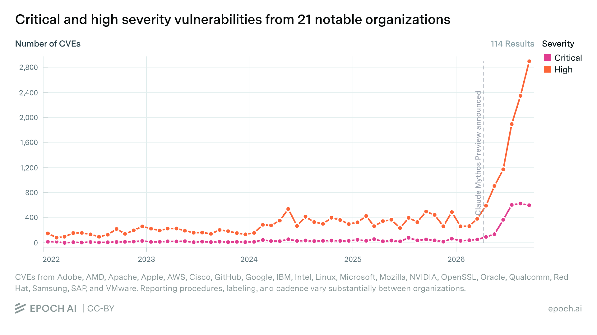

I bought a bunch of 'smart' devices on Amazon. I was able to hack most of them with AI. Let's talk about that!

AI <-> Cyber discourse has tended to focus on the rise in high-profile and high-severity exploits in critical software such as cURL, Linux, or Chrome. Rightly so - these pieces of vital infrastructure touch the digital lives of most internet users, making security flaws a really big deal. The folks behind the most advanced AI models are trying to make their top capabilities available to defenders first, hoping to shore up 'all the bugs' and fix issues before bad actors gain access to equivalent models to find the holes. The hope: eventually we'll fix up most of the bugs, and be left with vastly more secure software (albeit with a tumultuous transition period in the meantime).

Unfortunately, not all software is made by the handful of organizations with 'trusted access' to the best defence. You are surrounded by software - not just the apps on your computer, but the firmware on your printer, CD player, thermostat and smart fridge and the many layers of hidden software that make your wifi work and your smart watch buzz. Many of these devices rarely receive updates, and have historically relied on relative obscurity for security. How does AI change the equation here? Can today's AI agents worm their way into these hidden computers around us, and bend them to some nefarious purpose? Turns out, the answer is usually **yes**.

## A Motivating Example: DVD Drive Hacking.

I first started thinking about this when AIs began making progress on a long-time project of mine: reverse engineering a DVD drive with the aim of eventually taking full control of the laser and movement mechanisms for a microscopy project. DVD drives aren't supposed to be programmable - they're designed to let you, you know, play DVDs! But the manufacturers have ways of updating the firmware, and by probing the undocumented SCSI commands used by the updater, AI was eventually able to break through many layers of encryption, firmware validation and obfuscation to figure out how to write new code to the device and take complete control of the hardware. This was an incredible feat of reverse engineering, and one that only recently became possible. My attempts last year came to naught. Earlier this year Codex 5.4 was able to take the first steps, but it was only with GPT 6 Astra that I finally cracked the last puzzles and got it all working.

This is good news for me - I get to move forward with my project. But between this, some smaller examples I'd come across, and tales from others finding similar things (e.g. the fantastic ["Everything I Own, Owned"](https://schlarp.com/posts/everything-i-own-owned/) post), I began to wonder whether this newly emerging skill at hardware hacking was worth worrying about, and what info was out there for the people making decisions about such things.

## A Benchmark is Born

While there was some buzz on X as various tinkerers found ways to hack their devices for fun, I felt that there was a need for something a little more formal. So, I laid out my plan: a benchmark that would pit AI models against a range of hardware targets and track the rise in capabilities. Since I was unemployed at the time, I balked at spending $$$ on hardware to hack, but I put in for a few grants and thankfully one came through. This research has been partially funded by BlueDot - many thanks :) And with that HWREBench was born!

## Lessons So Far

I was initially picturing an automated rig, with multiple small computers each hosting an agent + a device under test, with hardware verification of successful exploits. However, as the devices I'd ordered began to arrive, I quickly realized that leaving agents unattended on cyber tasks was inviting disaster. Instead, I quickly settled into a rhythm of firing up one device at a time, connecting it to a dedicated wifi network or computer as applicable, and working with one AI model at a time to try to crack it. This lets me watch the chain of thought and tool calls to catch worrying directions before they get out of hand - and reading them, I can't help but think that anyone running fully-automated cyber evals must be dealing with (or missing) so much crazy stuff!

TODO:
- Introduce findings earlier re: what the AIs have been able to do?
- The ladder of skill (escalating from small + local to open + cheap to open + big to closed + big)
- Trends in what tends to be more secure
- What I'm still planning on doing

## Is This Bad?

TODO:
- This is great for tinkerers wanting full control of our devices.
- Many of these 'vulnerabilities' only apply if someone is already in your network/machine - and are thus worrying but perhaps smaller in the grand scheme of things
- It's worth thinking carefully about what you let on your network, or partitioning off smart devices in their own network
- Trust nothing with firmware
- Security is going to be an interesting space for a while yet!

## What Next?

TODO:
- Wrapping up my main bit of work
- Polishing up the list of [tasks](tasks.qmd)
- Writing blog posts going deeper on a few impressive exploits that I don't feel bad disclosing (still thinking through)
- Video
- Maybe a note on being nice

::: {.home-links}
[About the project](about.qmd)

[Read the blog](blog.qmd)

[Contribute](contributing.qmd)
:::
